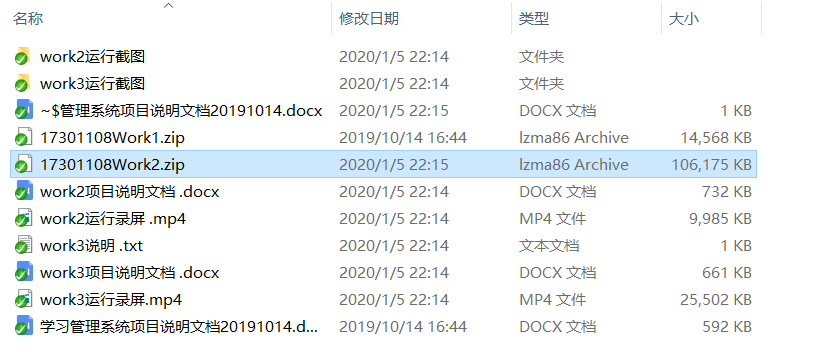

```diff
- 老师，因为提交作业的时候操作不当，导致原先的提交被覆盖了，希望老师原谅！
````



# Xing
# 学号：17301108
# 姓名：邢景龙

# Android个人项目
***
## 第一次作业
1. 项目压缩包
2. 项目说明文档
***
## 第二次作业
1. 运行截图
2. 运行录屏
3. 项目说明文档
4. 项目压缩包[^注1]

[^注1]:第二次作业的压缩包在Assigement1分支下
- 服务端代码压缩包
- 移动端代码压缩包
- 可运行APK
- 说明.txt
***
## 第三次作业
1. 运行截图
2. 运行录屏
3. 项目说明文档
4. 说明.txt
5. 项目压缩包[^注2]

[^注2]:第三次作业的压缩包在Assigement1分支下
- 服务端代码压缩包
- 移动端代码压缩包
- 可运行APK


